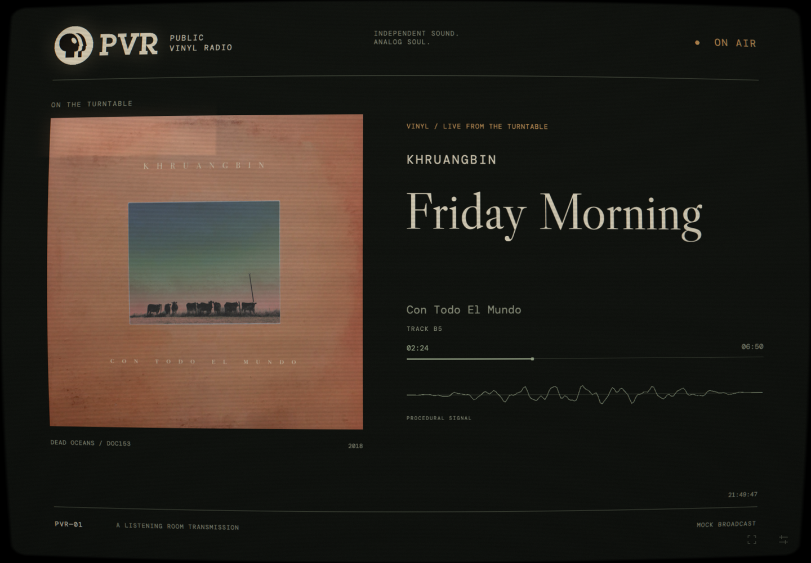

# PVR Analog

A fullscreen CRT now playing display for Public Vinyl Radio. The visual prototype and server-side Home Assistant integration are implemented. It displays your listening-room broadcast; audio playback is controlled elsewhere. Bundled Khruangbin metadata and artwork are available for mock mode.



## Run locally

Requires Node.js 22.18 or newer and npm.

```sh
npm ci
npm run dev -- --port 3011
```

Open <http://localhost:3011>. The server listens on all interfaces so an iPad on the same LAN can use `http://<your-computer-LAN-IP>:3011` for an early visual check.

For the production build:

```sh
npm run build
npm start -- --port 3011
```

The start script copies the bundled assets into Next.js's standalone output and starts its production server. Docker runs that server directly.

With no Home Assistant configuration, the server uses mock data. To force mock mode even when credentials are available, set `PVR_DATA_MODE=mock`.

## Worktree tasks with Herdr

Launch the repo session from a normal terminal with `just herdr`. Inside Herdr:

```sh
just herdr-task design/typography --agent codex --issue 1
```

Each task gets an isolated worktree, dependencies, and mock Next.js preview on
its own port. Supply `--prompt`, `--prompt-file`, or `--issue` to start an agent;
finish from the task's workspace with `just herdr-done`. Commit the helpers
before creating tasks so the base revision includes them.

See [Herdr worktree tasks](docs/herdr.md) for options, iPad preview URLs, and cleanup.

## Home Assistant and 1Password

The configured broadcast uses:

| Setting | Value |
| --- | --- |
| Home Assistant | `https://ha.home.arpa` |
| Media player | `media_player.living_room_audio` |
| Vinyl indicator | `binary_sensor.vinyl_listening_active` |
| Token reference | `op://Homelab/Home Assistant Codex Token/token` |

The binary sensor determines the source: **on → vinyl**, **off → streaming**. Missing, unknown, or unavailable sensor states leave the source unknown. Change the entity IDs in server configuration to use another player or sensor.

Install and sign in to the [1Password CLI](https://developer.1password.com/docs/cli/get-started/), then:

```sh
cp .env.1password.example .env.1password
npm run dev:ha -- --port 3011
```

For a production preview:

```sh
npm run build
npm run start:ha -- --port 3011
```

These scripts use [`op run`](https://developer.1password.com/docs/cli/secrets-scripts/) to resolve the reference into the server process environment. The reference file contains no resolved token and is ignored by Git and Docker. No token is needed during the build. Keep credentials in server configuration; never use a `NEXT_PUBLIC_` variable for them.

The example sets `NODE_OPTIONS=--use-system-ca` so Node trusts the local CA already installed on the Mac. If that CA is unavailable, install the public root certificate or set `NODE_EXTRA_CA_CERTS` to its file path. The Docker container needs its own trust configuration, described below.

`npm run inspect:ha` reads the two configured entities and prints a small metadata summary without printing the token or artwork query values. It does not change playback.

### Live behavior

The server authenticates to the [HA WebSocket API](https://developers.home-assistant.io/docs/api/websocket/), subscribes to `state_changed`, and processes updates for the configured player and vinyl sensor. It reads those two entities once on connection to establish the initial state. A heartbeat detects stale connections; reconnect delays increase with exponential backoff and jitter. `HA_RECONNECT_BASE_MS` and `HA_RECONNECT_MAX_MS` configure the delays.

Browsers receive normalized metadata over same-origin `/api/events`. They receive no HA token, raw media URLs, or artwork access parameters. Progress advances locally only while playing and only when timing data is provided. Paused playback freezes progress. Idle playback shows the station standby screen. Unavailable and disconnected states show their status; a disconnected display retains the last known track with frozen progress. Missing titles, artists, albums, artwork, and timing are left absent. The player's `label` and `year` attributes supply the record label and release year beneath the artwork. Year accepts a four-digit string or integer; absent or invalid values stay hidden. Release metadata updates redraw the picture without changing track identity.

Track identity excludes position updates, artwork refreshes, and connection changes. Analog track-change transitions will be added in Phase 3.

### Artwork

Artwork prefers Home Assistant's `entity_picture_local` proxy, falling back to `entity_picture` when the local URL is absent or not permitted. Relative URLs resolve against the HA base URL. This supports Groovenet covers hosted externally without adding their original hosts to the allowlist when HA supplies a local proxy. `/api/artwork` serves only artwork registered from the configured player, using opaque keys rather than accepting arbitrary URLs. HA-origin requests use the server token. Redirects are checked at every hop, and external origins never receive HA credentials.

External artwork is allowed only from HTTPS origins explicitly listed in `HA_ARTWORK_ORIGINS`, separated by commas. Leave this empty initially; add an origin if your integration returns covers from a separate image host. The proxy accepts common raster image types, limits responses to 8 MB, applies a timeout, and caches up to four recent covers. Failed or missing artwork uses the station sleeve. Texture swaps discard outdated async loads and dispose old GPU textures.

## Picture controls

Tap the small tuning icon in the bottom-right corner, or press **S**. Close with **Return to broadcast**, the close button, **Escape**, or a tap outside the panel. Controls adjust immediately and save visual preferences in local browser storage.

- Screen curvature, scanlines, phosphor bloom, animated grain, edge color separation, and rare signal disturbances.
- Warm broadcast, green phosphor, amber monochrome, and black and white profiles.
- Render scale and target frame rate, with measured rendering FPS shown inside the panel.
- **Animate the picture** can be disabled to produce a still picture. The initial setting respects the device's reduced motion preference.
- **Transmission** switches between the configured broadcast and mock data. The panel shows the current HA connection status.
- Three mock transmissions: vinyl with timing, streaming, and vinyl without timing. Missing timing produces no progress bar. Returning to the configured broadcast restores current HA state.

Defaults target 30 FPS. Full-size render targets are capped at approximately 2.4 million pixels. Animation stops while the document is hidden. A fullscreen button appears only when the browser reports support; use Home Screen installation on the iPad for a standalone display.

The small waveform is explicitly procedural. `SignalSource` is the adapter boundary for later audio analysis.

## Deploy on the Beelink

This app is intended for LAN and Tailscale access, with **no application authentication**, as agreed. The Compose service publishes its port on host loopback; Caddy is the browser-facing service. Restrict access to Caddy using your existing LAN and tailnet policy.

```sh
cp .env.example .env
docker compose up -d --build
```

That starts a mock broadcast. For the live broadcast, set `PVR_DATA_MODE=homeassistant` in `.env`, retain the 1Password reference for `HA_TOKEN`, and use:

```sh
op run --env-file .env -- docker compose up -d --build
```

The Beelink must be able to resolve and reach `ha.home.arpa`, and `op` must have access to the referenced vault. Compose injects the resolved token into the container's server environment. Docker administrators can inspect that environment; the browser receives no token. Restart through `op run` after rotating credentials.

For Caddy running on the host, merge [deploy/Caddyfile](deploy/Caddyfile) into your existing Caddy configuration. The default app upstream is `127.0.0.1:3010`. If you change `PVR_PORT`, update that upstream too.

For Caddy running in Docker, set `CADDY_NETWORK` in `.env` to the existing network Caddy joins, and run:

```sh
docker compose -f compose.yaml -f deploy/compose.caddy.yaml up -d --build
```

Use this site block in the existing Caddy container's configuration:

```caddyfile
now-playing.home.arpa {
    tls internal
    encode zstd gzip
    reverse_proxy now-playing:3000 {
        flush_interval -1
    }
}
```

For live mode with Caddy in Docker, wrap the Compose command above in `op run --env-file .env --` too. The flush setting lets metadata events reach the browser immediately.

Configure local DNS so `now-playing.home.arpa` resolves to the Beelink's reachable address. For access away from the LAN, your tailnet needs a reachable resolver for `home.arpa` (for example, Tailscale split DNS and a subnet route when using a LAN address). MagicDNS alone does not create custom `home.arpa` records. See [Tailscale DNS configuration](https://tailscale.com/docs/reference/dns-in-tailscale).

`tls internal` uses Caddy's local certificate authority. Install that Caddy instance's **root certificate** on the iPad and enable trust in **Settings → General → About → Certificate Trust Settings**. Use the public `root.crt` from Caddy's persistent data under `pki/authorities/local`; keep its private keys on the server. See [Caddy local HTTPS](https://caddyserver.com/docs/automatic-https#local-https).

### Trusting Home Assistant's local certificate in Docker

If `ha.home.arpa` uses the same Caddy CA, set `CADDY_ROOT_CERT` in `.env` to the **public root certificate file on the Beelink** and include the certificate override:

```sh
op run --env-file .env -- docker compose -f compose.yaml -f deploy/compose.ca.yaml up -d --build
```

If Caddy also runs in Docker, include both overrides:

```sh
op run --env-file .env -- docker compose -f compose.yaml -f deploy/compose.caddy.yaml -f deploy/compose.ca.yaml up -d --build
```

The override mounts only the public certificate read-only and sets [`NODE_EXTRA_CA_CERTS`](https://nodejs.org/download/release/v22.21.0/docs/api/cli.html#node_extra_ca_certsfile). TLS verification remains enabled. If HA uses a different local CA, mount its public root instead.

Only the metadata stream and restricted artwork endpoint are exposed. Cross-site browser requests are rejected; neither endpoint offers Home Assistant controls. LAN and tailnet access policy provides the access boundary, with no application login.

## Early iPad visual check

See [broadcast appearance and local fonts](docs/appearance.md) for artwork
visibility, per-field typography controls, and font registration instructions.

1. Open the prototype in Safari in landscape orientation. After deployment, use `https://now-playing.home.arpa`.
2. Use Safari's Share menu → **Add to Home Screen**, then open PVR Analog from the Home Screen. The manifest, app icons, and Apple standalone metadata are included. Orientation remains a browser/OS decision.
3. Check title readability from your normal listening position, artwork color, curved screen edges, and fine scanline spacing. Important content has an inset safe area even at maximum curvature.
4. Tune bloom and scanlines on the actual screen. Try all color profiles and mock transmissions, then return to the configured broadcast.
5. Read actual FPS in Picture controls. Start at 30 FPS and the default render scale; lower render scale if necessary. Desktop or software-rendered browser measurements do not establish iPad performance.
6. For an extended check, run for one hour and note heat, battery use, sustained FPS, and any signal interruption. Switch away and back to confirm recovery. Configure Auto-Lock manually.

Actual iPad Safari performance and a one-hour session still need to be checked on the device. This project includes no sleep prevention, push notifications, service worker, background audio, or offline playback.

## Architecture

```text
Home Assistant WebSocket + two initial entity reads / mock data
  → typed NowPlaying metadata + same-origin artwork proxy
  → Pixi text / artwork / graphics scene
  → offscreen picture texture
  → quarter-size bright-pass + separable blur
  → CRT filter (curvature, scanlines, noise, bloom, edge RGB shift, color profile)
  → fullscreen WebGL canvas
```

All picture elements are rendered in PixiJS and pass through the same CRT filter. Ordinary HTML is used for the hidden picture controls and startup/error states.

| Location | Responsibility |
| --- | --- |
| `src/lib/now-playing.ts` | Typed metadata, timing, and stable track identity |
| `src/lib/ha-normalization.ts` | HA metadata validation and vinyl sensor mapping |
| `src/lib/broadcast.ts` | Connection snapshot and initial waiting state |
| `src/lib/mock-data.ts` | Three manual mock broadcasts |
| `src/lib/preferences.ts` | Defaults, validation, and rendering pixel budget |
| `src/server/` | HA connection, credentials, artwork cache, and request policy |
| `src/app/api/` | Metadata event stream and restricted image endpoint |
| `src/hooks/useBroadcast.ts` | Browser subscription, visibility, and disconnection handling |
| `src/rendering/scene.ts` | Responsive broadcast composition |
| `src/rendering/shaders.ts` | WebGL GLSL shaders |
| `src/rendering/display.ts` | Targets, rendering loop, resize, visibility, cleanup, context recovery |
| `src/rendering/signal.ts` | Procedural signal and future input adapter |
| `src/components/` | Canvas lifecycle and picture controls |

Artwork is loaded from same-origin bundled files or the image proxy into explicitly owned textures. Resizes replace and dispose render targets, and component teardown releases scene, filters, textures, observers, and listeners. Context loss stops rendering and exposes **Restore picture**; successful context restoration rebuilds the renderer. Browser metadata subscriptions close while the page is hidden and reconnect on return.

## Checks

```sh
npm run test
npm run typecheck
npm run build
```

Focused tests cover saved preferences, parameter limits, the render pixel budget, playback timing, absent metadata, HA normalization, source detection, stable track identity, opaque artwork references, redirect credential isolation, response limits, and cache eviction.

The live HA authentication and idle-state stream have been checked locally, including heartbeat continuity and switching between live and mock input. Actual integration artwork and timing need a check while the media player is playing.

## Remaining milestones

- **Phase 3:** Track-change transitions, Station Ident, full Signal Visualizer mode, and source treatments.
- **Phase 4:** Device performance measurement, one-hour resource/heat review, and further Safari tuning.

See [asset credits](public/ASSETS.md) for artwork attribution and bundled font licenses.
